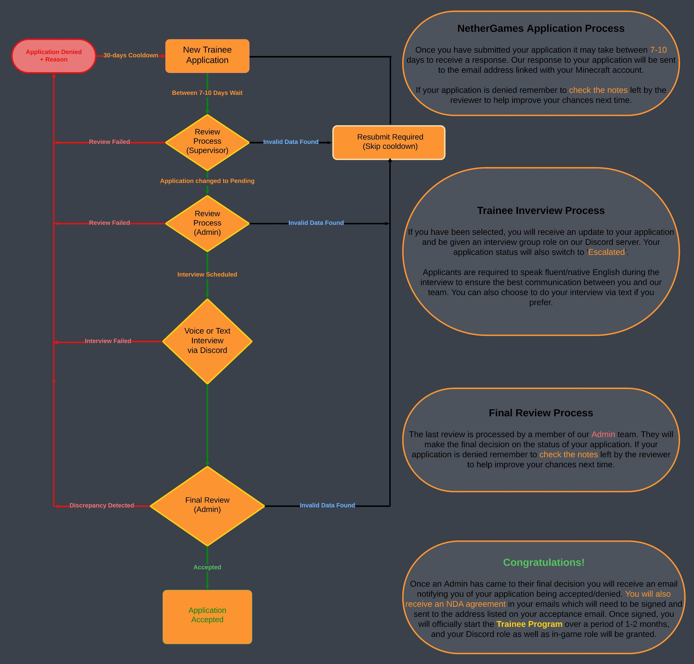

# The Trainee Process Explained 📝
 Thanks for taking an interest in applying for a Trainee position at NetherGames, we're excited to see what you can bring to our team. If you have already applied, great! Below we will go into further detail about how we choose our applicants, the application process, and what we look for in an applicant. We will also discuss the basic roles of a Trainee and the tasks they will be given once they receive that fancy yellow tag.

 ## The Application Process
 One of the first steps you will experience on your journey to becoming a Trainee is the application. To apply, you will need to submit a **Trainee** application which can be done [HERE](https://portal.nethergames.org/request/11))! You may need to sign in to your NetherGames Portal account to view the page. All done? Perfect! Now, you might notice a few requirements that must be met before you can start your application. These include:
 * Having your Discord account connected
 * Have been in the NetherGames Discord server for at least 30 days.
 * Joined the NetherGames Minecraft network more than 30 days ago.
 * No pending Trainee applications.
 * No active punishments on your account.
 * Not be a current Trainee on your account.

If you meet these requirements, you can press the "Continue" button, which will take you to the main application form.

 
 
 
