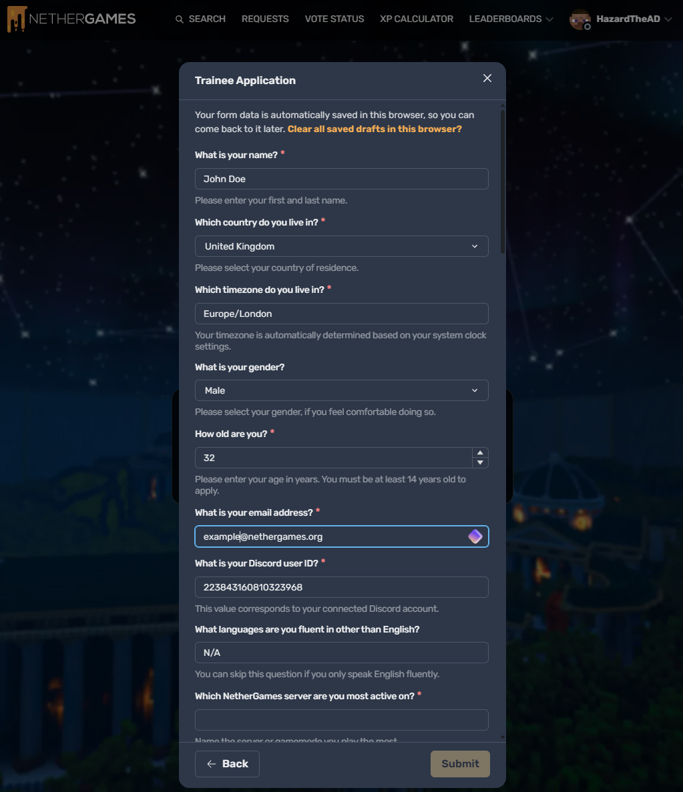

# The Trainee Process Explained
 Thanks for taking an interest in applying for a Trainee position at NetherGames, we're excited to see what you can bring to our team. If you have already applied, great! Below we will go into further detail about how we choose our applicants, the application process, and what we look for in an applicant. We will also discuss the basic roles of a Trainee and the tasks they will be given once they receive that fancy yellow tag.

 ## The Application Process 📝
 One of the first steps you will experience on your journey to becoming a Trainee is the application. To apply, you will need to submit a **Trainee** application which can be done [HERE](https://portal.nethergames.org/request/11))! You may need to sign in to your NetherGames Portal account to view the page. All done? Perfect! Now, you might notice a few requirements that must be met before you can start your application. These include:
 * Having your Discord account connected
 * Have been in the NetherGames Discord server for at least 30 days.
 * Joined the NetherGames Minecraft network more than 30 days ago.
 * No pending Trainee applications.
 * No active punishments on your account.
 * Not be a current Trainee on your account.

If you meet these requirements, you can press the "Continue" button, which will take you to the main application form.

### Filling out your application

When filling out your application, please provide as much detail as possible, and try not to include false information. We search for Trainees based on their skills, attitude, Typing, grammar/spelling skills, ability to detect a cheater, activity on the network, and more. We understand that there are a lot of questions to get through, and some might be hard to answer. However, this is the best method to help. If you are struggling with a question or require additional assistance, then you can always send a DM to our ModMail bot, where staff will provide tips, but not the answers to scenarios. 

::: info PLEASE NOTE
Staff are unable to provide the exact answer to the Trainee form questions. 
:::

Once you have finished filling out your Trainee application form, press the "Submit" button to send your application to our review department. Below we have also provided a flowchart on how our team reviews Trainee applications, as well as the application process in further detail. 

 
